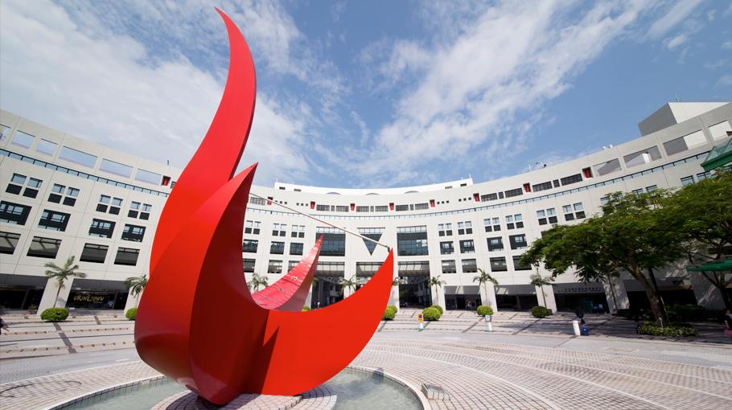

# HKUST Internet Research Workshop 2024

## Workshop on Future Internet Research Directions

Mar 15, 2024  
Room 4475, HKUST, Clear Water Bay campus  
[http://hkirw.github.io/2024](http://hkirw.github.io/2024)

In the week before the [IETF-119 meeting in Brisbane](https://www.ietf.org/how/meetings/119/), this workshop aims to bring together researchers in computer networking and systems around the globe to a live forum discussing innovative ideas at their early stages. The mission of the workshop is that promising but not-yet-mature ideas can receive timely feedback from the community and experienced researchers, leading them into future IRTF work, Internet Drafts, or IETF working groups.

The workshop will operate like a “one day [Dagstuhl](https://www.dagstuhl.de/) seminar” and will focus on discussion and ideas exchange and less on conference-style presentations. The objective is to identify topics and connect like-minded people for potential future collaboration.

## Topics of Interest

Topics include but are not limited to:

* Networking for AI, e.g.: transport protocols, distributed ML at scale  
* Constrained environments  
* Future web, e.g, decentralization, federation, information-centricity  
* Future media distribution, e.g., large-scale & low latency communication

Topics can be anything related to Internet research, but are expected be controversial – that’s the purpose of this workshop\!.

## How to Contribute

We extremely welcome suggestions for a discussion topic and/or a lightning talk. Please contact the organizers (see below).

## Program Outline

| Time (UTC+8) | Event |
| :---- | :---- |
| **09:00 – 09:10** | **Welcome Remarks** Chairs: Dirk Kutscher and Zili Meng (HKUST) |
| **09:10 – 10:20** | **Topic 1 – Network for Distributed ML** |
| 09:10 – 09:20 | Lightning talk – Challenges and Some Ideas Dirk Kutscher (HKUST) |
| 09:20 – 10:20 | Discussion:  What are the fundamental challenges for transport?                      Directions for IRTF/IETF |
| **10:20 – 10:35** | **Coffee Break** |
| **10:35 – 11:45** | **Topic 2 – Low-latency Internet Distribution** |
| 10:35 – 10:45 | Lightning talk – Overview of the delivery pipeline Zili Meng (HKUST) |
| 10:45 – 11:15 | Lightning talk – Remote driving of Autonomous Driving Jianping Wang (City University of Hong Kong) |
| 11:15 – 11:45 | Discussions: Application Scenarios                      Interdisciplinary Collaborations |
| **12:00 – 14:00** | **Lunch** [UniBistros & Bars](https://www.conferencelodge.hk/en/food-beverage/unibistroandbar.html) |
| **14:00 – 16:00** | **Fireside Chat – Where will network research go?** |
| 14:00 – 14:40 | Topic: The philosophy behind computer network Moderator: Jianfei He (CityU) |
| 14:40 – 15:20 | Topic: Device Infrastructure Continuum Moderator: Carsten Bormann (U. Bremen) |
| 15:20 – 15:50 | Topic: The role of industry and academia in network research Moderator: Zili Meng (HKUST) |
| **15:50 – 16:00** | **Wrap-Up** Chairs: Dirk Kutscher and Zili Meng (HKUST) |
| **18:00 – 21:00** | **Dinner Banquet** |

## Register

Please [register here](https://forms.gle/Y2BzwgJypZT91QmAA).

If you need an invitation letter, please contact [zilim@ust.hk](mailto:zilim@ust.hk).  

## Workshop Venue

Classroom 4475 (Lift 25/26), Main Academic Building.

[How to get from HKUST Atrium (at the North Gate of the campus) to Room 4475?](https://pathadvisor.ust.hk/search/from/Atrium;tYkl7OmZOcvN;G;2,79/to/ROOM%204475;coynVUCJ766;4;1387,-98/via$/LIFT%2025;RUScoNThmkK;1;1549,-203/floor/G/at/normalized/-2,80,3)

## Hotel Information

- Crowne Plaza Hong Kong Kowloon East ([website](https://www.ihg.com/crowneplaza/hotels/us/en/hong-kong/hkgtk/hoteldetail))  
  - Tower 5, No. 3 Tong Tak Street, Tseung Kwan O, Hong Kong, (852) 3983 0388  
- Vega Suites ([www.vegasuites.com.hk](https://www.vegasuites.com.hk/))  
  - 3 Tong Tak Street, Tseung Kwan O, Hong Kong, (852) 3963 7888

## Local Transportation

Uber is the most convenient tool for visitors in Hong Kong.

From Hong Kong International Airport to Tseung Kwan O (the nearest neighborhood of HKUST).

- By Taxi: Approximately 45 minutes, HKD $400, cash only or Uber.  
- By Bus Line A29: Approximately 70 minutes, HKD $50, see the [website](https://www.hongkong.net/transportation/to-from-airport/bus/a29).

From Tseung Kwan O to HKUST.

- By Taxi: Approximately 15 minutes, HKD $60, cash only or Uber.  
- By Bus Line 792M: Approximately 25 minutes, HKD $7.9, see the [website](https://hkbus.app/en/route/792m-1-tseung-kwan-o-station-sai-kung).

## Local Contact

Zili Meng

- Whatsapp: (+852) 5734-9660  
- Call/text: (+852) 5734-9660  
- WeChat: meng\_zili

## Social Dinner Info

(self-funded)  
Duddell’s. [https://www.duddells.co/home/en/](https://www.duddells.co/home/en/)   
1 Duddell Street, Central, Hong Kong

## Organizers

* [Dirk Kutscher](https://dirk-kutscher.info/), HKUST(GZ), [dku@hkust-gz.edu.cn](mailto:dku@hkust-gz.edu.cn)   
* [Zili Meng](https://zilimeng.com/), HKUST, [zilim@ust.hk](mailto:zilim@ust.hk) 
